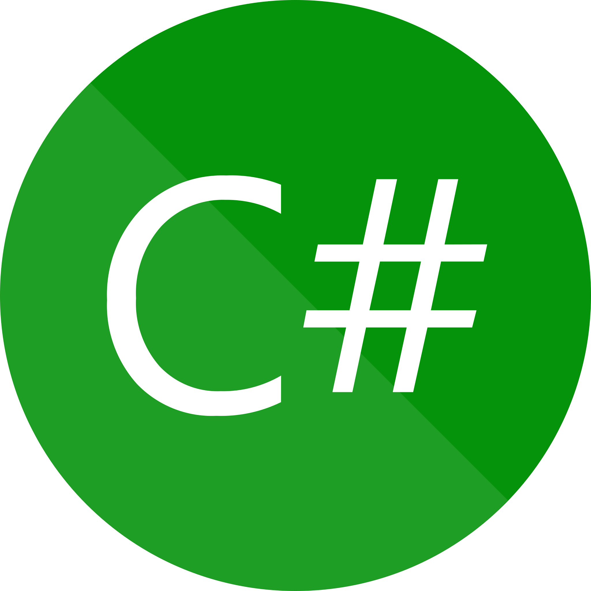

<h1> Hey! Nice to see you.</h1>

  👋 Welcome to my page! I’m @ParsProgrammer
  👀 I’m experienced in software development and AI engineering
  💜 I'm passionate about applied science, start-ups, and e-commerce platforms
  🧩 My favorite hobbies are going to the gym, playing volleyball, watching scientific shows and podcasts
  🦸 My role model is Tom Bilyeu
  🌞 Data is my religion
 

<h1>My Story</h1>

I am a single-minded engineer passionate about the utility of tech in businesses. No wonder I have been learning web development since early 2017. During my bachelor's study in software engineering, I worked part-time for a startup project, Photocans, as a web developer. The engagement in this project not only put me into the skill acquisition mode but also familiarized me with real challenges in business.
For my master's degree, I have decided to study AI because it dawned on me that extracting insights from data highly benefits companies and organizations. Recommendation Systems as a tool for boosting online businesses initially drew my attention, so I picked up this case study for my research area. Furthermore, I have become familiar with the concept of XAI (explainable AI). The intersection of the Recommendation System and XAI, called the Explainable Recommendation System, was a compelling topic for me so I have decided to complete my thesis specifically in that field.

<h1>Technology Skills</h1>
 

    
    
    
    
    
    
    
    
    
    
    
    
    
    
    
    

 
<h1>Contact</h1>
 

    
    
    
    

<!---
mobinpersi/mobinpersi is a ✨ special ✨ repository because its `README.md` (this file) appears on your GitHub profile.
You can click the Preview link to take a look at your changes.
--->
