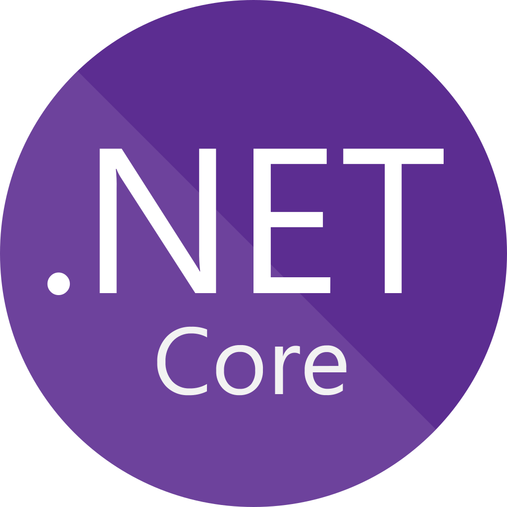

<h1> Welcome to my page!</h1>

  👀 I’m Mobin, experienced in software development and AI engineering.
  💜 I'm passionate about applied science, start-ups, and e-commerce platforms.
  🧩 My favorite hobbies are going to the gym, playing volleyball, watching scientific shows, and podcasts.
  🌠Data is my religion.
 

<h1>Featured Work</h1>

<h2>Research Projects</h2>

<h3>🔍 Exogenous Cues</h3>

Explored and evaluated contextual quality-related variables (exogenous cues) to enhance the information quality of media recommendations.

<h3>🤝 Trustworthy Media Recommender</h3>

Integrating contextual quality signals (exogenous cues) into standard recommendation algorithms to develop an augmented model.

<h3>💡 Explainable Recommendation System</h3>

Focused on a multi-task framework that not only recommends items to users but also generates personalized explanations to enhance transparency, trust, and user satisfaction.

<h3>📡 Automated Reddit Scraper for Political Discourse</h3>

Developed APIs to collect and analyze political discussion data from a subreddit for research on online discourse.

<h2>Software Projects</h2>

<h3>📸 Photocans</h3>

A web application for showcasing and selling a software product online, featuring a managerial admin dashboard and client support tools.

<h3>🏢 Conference Halls Reservation Management System (<em>ReserveAfzar</em>)</h3>

A web-based application for automating hall reservations at Bu-Ali Sina University, enabling academic staff to book venues online for events and seminars.

<h3>🏠 Real Estate Agency Management System</h3>

A comprehensive system for managing property listings, clients, and transactions.

<h1>Technology Skills</h1>
 

    
    
    
    
    
    
    
    
    
    
    
    
    
    
    

  <!-- Programming Languages -->
  
  
  
  

  <!-- UI Design Technologies -->
  
  
  
  
  

  <!-- Python Libraries -->
  
  
  
  
  
  

  <!-- .NET Frameworks -->
  
  
  
  
  

  <!-- Databases -->
  
  
  

  <!-- Other Tools -->
  
  
  
  
  
  
  

 
<h1>Contact</h1>
 

    
    
    
    

<!---
mobinpersi/mobinpersi is a ✨ special ✨ repository because its `README.md` (this file) appears on your GitHub profile.
You can click the Preview link to take a look at your changes.
--->
